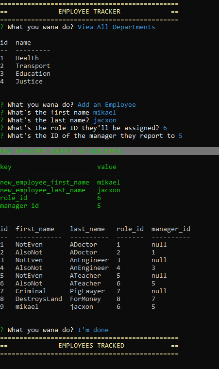

# **
 MoesEmployeeTracker 
**

## **Contents**
- [Description](#description)
- [Technologies](#technologies)
- [The Recipe](#the-recipe)
- [License](#license)
- [Shout Outs](#shout-outs)
- [Screen Shot](#screen-shot)
- [Links](#links)
- [Improvements](#improvements)

 

## **Description**
Employee Tracker database that can view/add departments, roles, employees and also update them (currently only the employee, will do others later)
  
Application is executed through node.js, user is prompted by inquirer to do what they want.

## **Technologies**
- JavaScript, jQuery
- Node.js, MySQL
- npm dependencies: cli-color, console.table, dotenv, inquirer, mysql2
- Computer

## **The Recipe**
1. Clone this repo to the location of your choice
2. Create a new file called `.env` in the root folder
3. Copy and paste the text in the `.env.EXAMPLE` file into the `.env` file you just created
4. Add your MySQL username and password
5. Open your command terminal in the root folder of the repo
6. Run `npm install`
7. Run `mysql -u YOURmysqlusername -p` and type in your password  
P.S. replace `YOURmysqlusername` with your ACTUAL MySQL username
8. Run `SOURCE ./db/schema.sql;` to create the tracker database
9. Run `SOURCE ./db/seeds.sql;` to seed some data into the database (you can alter/add your own)
10. Run `quit` and MySQL should wish you bye
11. Run `node server.js`
12. Now go through the options and do what you want

## **Improvements**

App crashes when certain unique ID values are inputted that already exists. Need to add some code to not allow the user to input an ID already in use. Need to add features like deleting certain data and could do with better file structure.

## **License**

MIT License, do what you want.  
The only crime that could possibly be comitted here would be actually using this note taker

## **Shout Outs**

Shout out to the real MVP, Stack Overflow

## **Screen Shot**

## **Links**

